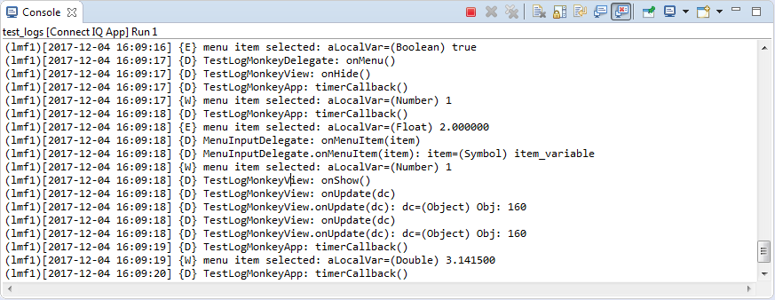

# LogMonkey

The LogMonkey barrel provides logging utilities to aid in developing and debugging Connect IQ applications.

Information can be logged to certain log levels via the available APIs. The supported log levels are:
| API             | Purpose                                                |
| --------------- | ------------------------------------------------------ |
| LogMonkey.Debug | General debugging information                          |
| LogMonkey.Warn  | Warning messages about potential issues within the app |
| LogMonkey.Error | Errors that have occurred within the app               |

## Adding LogMonkey to Your Project

See the general instructions for [including Monkey Barrels](https://github.com/garmin/connectiq-apps/tree/master/barrels#including-monkey-barrels).

## Logging Information

Once you've added LogMonkey to your project you can import it into your code via `using` statements.
```
using LogMonkey as Log;
```
Within you're project's code you can log messages, variables and Exceptions via the available APIs.
```
using LogMonkey as Log;

class MyClassOfThings {

    function aFunctionOfLogic(aParameter) {
        Log.Debug.logMessage("MyClassOfThings", "aFunctionOfLogic()");
        Log.Debug.logVariable("aFunctionOfLogic() param", "aParameter", aParameter);
        ...
        try {
            ...do something horribly, horribly wrong...
        } catch (ex) {
            Log.Error.logException("Attempting to do XYZ", ex);
        }
        ...
        if (aLocalVariable == aPotentiallyProblematicValue) {
            Log.Warn.logVariable("aFunctionOfLogic()", "aLocalVariable", aLocalVariable);
        }
        ...
    }

}
```

## Viewing and Parsing Logs

LogMonkey makes use of `Toybox.System.println()` calls to log information. This means that if your app also makes use of `pinrtln()` calls they will show up alongside the log entries.

### Output Format

LogMonkey logs each line in the file in the following format: `(log format version)[timestamp] {log level} tag: message`. Details for each block of this format are given in the table below.
| Block              | Format                                                 | Description                                                                         |
| ------------------ | ------------------------------------------------------ | ----------------------------------------------------------------------------------- |
| log format version | A value beginning with "lfm" then a number             | The output format version of the line in the log.                                   |
| timestamp          | MM-DD-YYYY HH:MM:SS                                    | A time stamp of when the log entry occurred.                                        |
| log level          | Regular Expression: `[a-zA-Z0-9_]`                     | The priority level of the log entry. LogMonkey supports values of `D`, `W` and `E`. |
| tag                | A string containing any character except a colon (`:`) | A brief tag value that can be used to quickly filter and find specific log entries. |
| message            | Any string value                                       | The detailed message being recorded in the log entry.                               |

### Viewing Logs in Eclipse

When you run an app via Eclipse the run console will show the output of log calls. You will see the information your app is logging in the raw LogMonkey output format.


### Viewing Logs on a Device

When running your app on a physical device the log statements get added to the app's log file. The app's log file can be viewed by plugging your device into your computer and navigating to `<device root>/GARMIN/APPS/LOGS`. The app log file will match the name of the app prg file (located in `<device root>/GARMIN/APPS`.

### Parsing Logs

There is a [parse_log_file.py](parse_log_file.py) [Python](https://www.python.org/) script provided that can parse and filter log files to help find relevant log entries while developing an app. The script accepts raw LogMonkey files as well as log level and tag filters to narrow down log output. If other pieces of information are contained in the file that information will be ignored by the script.
```
python parse_log_file.py -l E -t communication my_log_file.txt
```
For detailed script use run the help command: `python parse_log_file.py -h`.
